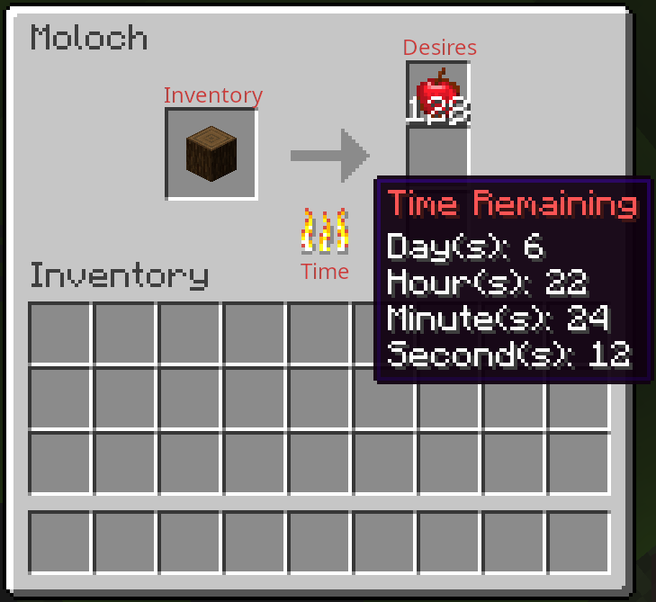

# Moloch

<p align="center"></p>

<a href="https://github.com/Concordia-Modding-Community/moloch/releases"></a>
<a href="https://github.com/Concordia-Modding-Community/moloch/releases"></a>
<a href="https://github.com/Concordia-Modding-Community/moloch/blob/main/LICENSE"></a>
<a href="https://github.com/Concordia-Modding-Community/moloch/actions/workflows/gradle.yml"></a>

## Overview

Moloch is a modernism mod that aims to incorporate [Moloch](https://en.wikipedia.org/wiki/Moloch) into Minecraft. We draw close inspiration to the industrial Moloch found in [Metropolis (1927 film)](https://en.wikipedia.org/wiki/Metropolis_(1927_film)). This mod incorporates customizeable blocks/structures that allows for a tyrant/capitalist rule. These are respresented as operator desires, which can lead in either rewards or punishments on the workers.

<p align="center"></p>

## Features

Moloch incorporates (including many others) the following:

- Highly customizeable progressions, desires, and rewards/punishments.
- Compability with most other mods.
- Teams support.
- Singleplayer + Multiplayer support.

## For Workers

The following sections outlines how to use Moloch as a worker. 

### Overview

Moloch is the all seeing and all-consuming tyrant ruler. He will request from you a selection of items over time. You may choose to ignore his requests, but doing so will lead to punishments. Following orders will provide you with a reward (which may be simply not getting a punishment). The operator will choose how miserable he wants to make your existence.

### Moloch UI

You can access Moloch's interface by right-clicking on `Moloch's Heart`. The following image is the labelled interface. It is similar to a vanilla furnace. 

<p align="center"></p>

#### Inventory

The left slot is the input. This allows you to drop items to fulfill Moloch's desires. You can place items into this slot through hoppers (or other dropping block).

#### Time

The fire represents the amount of time remaining before punishment(s). You can hover the flame to get the time remaining in textual form.

#### Desires

The right slots are Moloch's desires. These can be any valid Forge item. The amount for these will deminish as they consume from the inventory slot. The order does not matter.

## For Operators

The following sections will provide information/commands for operating the Moloch block. There may eventually be a user interface to streamline the creation process.

Assume that all times are in miliseconds from the epoch, so use `1614449380570lL` notation for starts and ends. `interval` is small enough that you can just put an unmarked number, but `variance` should use the `L` notation as the desired standard deviation will be the square of the variance.

### Moloch

Each moloch block represents an aspect of the angry all-consuming Moloch! Moloch progresses through sequences of desires, which when met result in rewards for the affected folks, and when not met, result in punishment. As such, Moloch can be treated as a sequence of progressions that start and end.

#### Data Structure

```
{
	molochName: "Moloch", 
	subjects: [], 
	progressions: [], 
	x: 29, y: 64, z: -12, 
	Items: [], 
	id: "moloch:moloch"
}
```

##### molochName field

The basic structure has the `molochName` (defaults to "Moloch") that users will see when they interact with the moloch block. 

##### subjects field

`subjects` lets moloch know which players it should pay special attention to. 

##### progressions field

`progressions` are the meat of the moloch mod and are explained in detail below.

##### Items field

Since the moloch block is a container, it contains a list of `Items`.

#### Usage

The following is the usage for the moloch block. Assume that `<item>` is any item id and `<amount>` is a stack size, though all this is subject to the regular container restrictions (it'll ignore trying to append with other slots). Keep in mind that since this is the vanilla data command, `<targetPos>` can either be x, y, z coodinates or any of the usual target selectors.

##### Inspect Data

You can inspect your moloch with:

```
/data get block <targetPos>
```

(Make sure you've got a moloch block to edit before you start messing around or it will be very boring for you)

##### Update Moloch's Name

You can update the name of your moloch with 

```
/data modify block <targetPos> molochName set value "<newName>"
```

##### Adding Subject

You can append subjects with

```
/data modify block <targetPos> subjects append value <NAME|UUID>
```

where you can user either a username or a uuid. If recognized, you'll see that UUIDs are used to populate the NBT data, and the `<NAME>` is just allowed as a convenient shorthand. It populates out of UsernameCache, so if users aren't there, Moloch will not deign for them to be subject to their whims. 

##### Removing Subject

You can remove subjects by `<index>`:
 
```
/data remove block <targetPos> subjects[<index>]
```

##### Modify Inventory

You can change the contents of the moloch block's inventory slot with 

```
/data modify block <targetPos> Items append value {id: "<item>", Slot: 0, Count: <amount>}
```

##### Remove from Inventory

You can empty the slot using 

```
/data remove block <targetPos> Items[0]
```

### Progressions

Each progression has  a list of desired items with a desired amount associated with each. During a progression, players may move items into the single slot container of the moloch block, where, if they are desired items, they will be gradually consumed. If all desired items in a progression are consumed before it ends, moloch will bestow the specified rewards. However, if the end of the progression is reached without all desires being met, punishments will be meted out instead!

#### Data Structure

```
{
  id: 1L,
  start: 1614449380570L, 
  end: 1614535740000L, 
  active: 0b, 
  rewards: [],
  punishments: [], 
  desires: [], 
}
```

##### id field

The `<id>` should be a unique long, but for now it isn't checked. Future versions will use it as a shorthand for editing things.

##### start/end field

`<start>` and `<end>` are in miliseconds from the epoch (you can look some place like https://currentmillis.com/ to do quick conversion), with the progression not becoming active until `<start>` (hopefully that's working) and Moloch not activating punishments until `<end>` passes with unfulfilled desires. If omitted, `<start>` will default to the current time. If `<end>` is omitted, it will default to a week after start.

##### active field

Note that we start `<active>` as false because we do not want this progression to get seen or used by players until it is ready, and accordingly if omitted `<active>` will default to `0b` (`false`). 

##### desires/rewards/punishments fields

For now, the `desires`, `rewards` and `punishments` act as placeholder, defaulting to empty lists when omitted. We'll look at filling these in a little further below.

#### Usage

The following section is the usage. Assume that `<i>` is the 0-based index of the progression you want to inspect.

##### Adding Progression

Building a full progression is a bit long for one command, so you may want to break it up and start with a blank progression: 

```
/data modify block <targetPos> progressions append value {id: <id>, start: <start>, end: <end>, active: 0b}
```

##### Adding Multiple Progressions

You can append multiple progressions and check all of them:

```
/data get block <targetPos> progressions
``` 

or each of them by index:

```
/data get block <targetPos> progressions[<i>]
``` 

##### Removing Progression

You can remove progressions by index:

```
/data remove block <targetPos> progressions[<i>]
```

##### Modify Progression

You can update specific fields of a progression:

```
/data modify block <targetPos> progressions[<i>].active set value 1b
``` 

(which sets that progression as active... but don't do that till you've set up the desires and rewards/punishments first!)

### Desires

Desires represents items that Moloch desires (which appear in the right pannel on the worker's UI). The amount is not limited to Minecraft stack size, therefore can be set to any value.

#### Data Structure 

```
{
  id: 1L, 
  item: "minecraft:apple", 
  amountTotal: 4, 
  amountRemaining: 2
}
```

##### id field

As with progressions, the `<id>` should be unique to the desires in this moloch (and progression), but it is not currently checked. 

##### item field

The `<item>` should be the id of the item, e.g. `minecraft:apple`, and thus it can support items from modded Minecraft. A `barrier` will be shown in the container interface if the item cannot be found (or if you foolishly say that Moloch desires a barrier item); note that if this is not corrected, that progression will invariably lead to punishment as mortals may not give Moloch barriers...

##### amount fields

When active as the current progression, the first three desired items will be visible, along with the `amountRemaining` for each of them. `amountTotal` must be a positive integer and will default to `1` if omitted. `amountRemaining` must similarly be a positive integer, and will default to whatever `amountTotal` is if omitted.

#### Usage

The following explains the usage. Assume that `<j>` is the 0-based index of the rewards you want to inspect in progression with 0-based index `<i>`.

##### Adding Single Desire

To add desires to the new progression, you can do something like:

```
/data modify block <targetPos> progressions[<i>].desires append value {id: 1, item: "<item>", amountTotal: 4, amountRemaining: 2}
```

##### Adding Multiple Desires

You can append multiple desires and check all of them:

```
/data get block <targetPos> progressions[<i>].desires
```

or each of them by index:

```
/data get block <targetPos> progressions[<i>].desires[<j>]
```

##### Removing Desire

You can remove desires within a progression by index:

```
/data remove block <targetPos> progressions[<i>].desires[<j>]
```

##### Updating Desire

You can update specific fields of a desire within a given progression:

```
/data modify block <targetPos> progressions[<i>].desires[<j>].item set value "minecraft:cake"
```

(Who doesn't like cake?!?! You'll note that your can ask for a ton of cake, as Moloch is not bound by mortal restrictions on stacks of cake)

### Rewards/Punishments

Rewards and Punishments use `<actions>`. When all desires are met for a progression, all rewards become active, running a number of times based upon the conditions set. If desires fail, punishments are ran according to their conditions.

#### Data Structure

```
{
   id: 1L, 
   type: 0, 
   doInitial: 1b, 
   doCountTotal: 1,
   doCountRemaining: 1, 
   lastRun: 0L, 
   variance: 0L, 
   active: 0b, 
   interval: 0, 
   command: "/say REWARD!"
}
```

##### id field

As with progressions/desires, the `<id>` should be unique to the rewards/punishments in this moloch (and progression), but it is not currently checked. 

##### type field

The `type` represents the specific nature of the action. Currently, only the command action (`type: 0`) is implemented, and it takes a `command` which is exactly the sort of single command you might find in a command block, like the above `command: "/say REWARD!"` which will cause Moloch to speak (using the `molochName` you set above) the word `REWARD!`. I'm taking requests for additional types of action besides a basic command action, since some things are either tricky or downright impossible to do with that.

##### looping fields

`doInitial` indicates whether this action will run immediately when queued, so, for example, a reward would run immediately after the last desired item were consumed in a progression. This is the default behaviour, and can be omitted if this is what one wants for a reward. There are cases where one does not want an immediate action, and in this case one can use `doInitial: 0b`. `doCountTotal` represents how many times the action will occur and must be a positive integer, which will default to `1` if omitted. `doCountRemaining` must similarly be a positive integer, and will default to whatever `doCountTotal` is if omitted. 

##### inteveral field

If an action is to occur more than once, `interval` specifies the mean time between occurrences, and defaults to `10000` (10 seconds), where variance represents the statistical variance and so 68% of the time the action will run between the `interval` - the square root of the `variance` and the `interval` + the square root of the variance. If the `interval` were 20000 (20 seconds) and the `variance` were 9000000 (strandard deviation of 3000 (3 seconds)) then 68% of the time Moloch would wait between 17 and 23 seconds before running the next action, and 29% of the time Moloch would wait between either 14-17 seconds or 23-26 seconds before running the next action, etc.. If `interval` is set to smaller than 1000, it will be reset to 1000.

#### Usage

The following explains the usage. Assume that `<j>` is the 0-based index of the rewards you want to inspect in progression with 0-based index `<i>`.

##### Adding Reward

To add rewards to the new progression, you can do something like:

```
/data modify block <targetPos> progressions[<i>].rewards append value {type: 0, id: <j>, doInitial: true, doCountTotal: 4, doCountRemaining: 3, active: 0b, command: "<command>"}
```

##### Adding Punishment

To add punishments to the new progression, you can do something like:

```
/data modify block <targetPos> progressions[<i>].punishments append value {type: 0, id: <j>, doInitial: true, doCountTotal: 4, doCountRemaining: 3, active: 0b, command: "<command>"}
```

##### Adding Multiple Rewards/Punishments

You can append multiple rewards/punishments and check all of them:

```
/data get block <targetPos> progressions[<i>].rewards
```
or each of them by index:

```
/data get block <targetPos> progressions[<i>].rewards[<j>]
```

## Acknowledgments

We want to thank the Concordia University Part-time Faculty Association for the Professional Development Grant that allows us to develop/contribute to the open source community.

Additionally, we want to thank the TAG team + ENGL 398C team/students for contributions and feedback on the mod. 